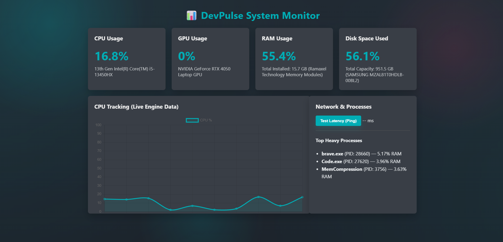

# 📊 DevPulse System Monitor

A lightweight, real-time, high-performance system monitoring dashboard built with **Flask (Python)** and **Chart.js (JavaScript)**. The engine uses low-level native OS pipelines and direct driver memory hooks to track core hardware components instantaneously with near-zero resource overhead.

## 🚀 Final Product Preview

Below is the execution state of the active deployment panel capturing hardware distribution:



---

## ✨ Features

* **Zero-Lag Live Updates:** Real-time microsecond polling architecture for utilization tracking.
* **Dynamic Component Detection:** Automatically checks host platform specifications (Intel/AMD/NVIDIA) to map matching local hardware properties dynamically.
* **Direct NVIDIA Memory Hooks:** Leverages the native NVIDIA Management Library (`NVML`) API to poll discrete GPU architectures without inducing sleep-wake hardware cycle stutters.
* **Top Resource Consumers:** Active extraction mapping out the top 3 highest RAM-consuming runtime tasks.
* **Built-in Ping Latency Tester:** Direct low-level subprocess ICMP packet testing to diagnose remote server connectivity instantly.
* **Adaptive UX Guardrails:** Cards dynamically shift to high-priority alert states if core capacity thresholds breach **85%**.

---

## 🛠️ Tech Stack

* **Backend Engine:** Python 3.13+, Flask
* **Hardware Extraction Kernel:** `psutil`, `nvidia-ml-py`
* **Frontend Interface:** Vanilla HTML5, CSS3 Variables, JavaScript (ES6+ Async/Await)
* **Data Visualization Engine:** Chart.js

---

## 📦 Installation & Setup

1. **Clone the Repository:**
   ```bash
   git clone [https://github.com/yourusername/devpulse-monitor.git](https://github.com/yourusername/devpulse-monitor.git)
   cd devpulse-monitor
Initialize Environment Variables:
Create a .env file in the root directory:

Code snippet
DASHBOARD_PASSWORD=your_secure_admin_password
Install Core System Dependencies:
Ensure you have your execution packages up to date:

Bash
pip install -r requirements.txt
Launch the Real-Time Engine:

Bash
python app.py
Access the Interface:
Open your preferred browser engine and target:
http://127.0.0.1:5000

📁 Repository Structure
Plaintext
├── .github/
│   └── assets/
│       └── screenshot.png  # Dashboard UI preview asset
├── app.py                  # Central Flask Application Core & Hardware Worker Threads
├── .env                    # Protected Environment Keys (Ignored by Git)
├── .gitignore              # Repository Tracking Exclusions Rulebook
├── .gitattributes          # Cross-Platform Core Line-Ending Standardizations
├── requirements.txt        # Frozen Project Execution Package Dependencies
├── templates/
│   └── index.html          # Structural HTML5 Dashboard Layout Panel
└── static/
    ├── css/
    │   └── style.css       # Modern Dark/Material Component Design Architecture
    └── js/
        └── main.js         # Asynchronous Background Data Collectors & Charts